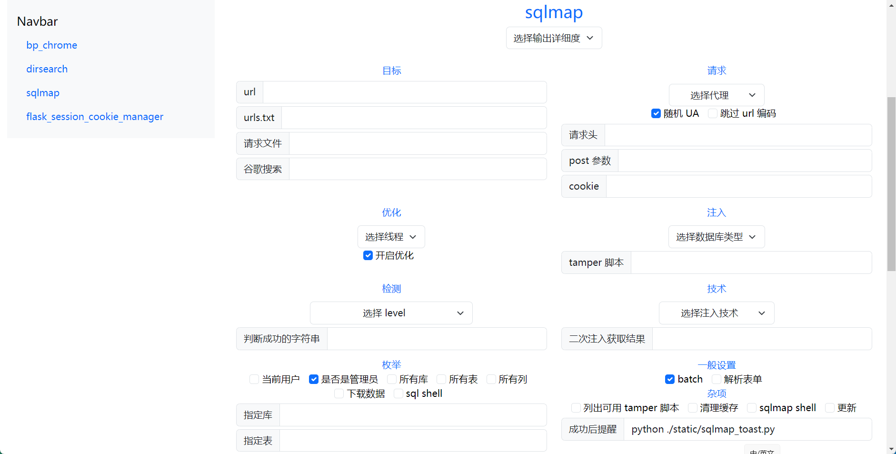

# 命令启动器 command_runner
命令启动器：为一些命令制作了 GUI，如 sqlmap，flask_session_cookie_manager

# 技术

前端：HTML + CSS（Bootstrap）+ JS

后端：Python

# 使用流程
启动界面：双击命令启动器.pyw，启动 webview 来渲染界面，并且把 Python 函数提供给 JS 调用

启动命令：在界面选择并输入相关参数，JS 调用 API，Python 启动命令

# 展示如下：

# 注意事项
- 需要 Python >= 3.10，因为使用了 match-case
- 部分参数默认开启，如 sqlmap 的 --batch，修改请移步 gui.html，将对应参数的 checked 删除即可关闭